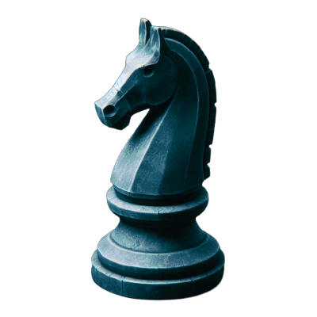

# [ChessReact]()

___
## Sobre el Proyecto
El objetivo principal de ChessReact es proporcionar a los entusiastas del ajedrez una plataforma en línea para jugar partidas de ajedrez contra una IA evolutiva. La inteligencia artificial utilizada en este proyecto sera entrenada para ofrecer desafíos de ajedrez considerablemente, lo que garantiza una experiencia enriquecedora para **jugadores de todos los niveles**.

## Objetivos

- Juegar partidas de ajedrez en línea contra una IA avanzada.
- Explora partidas históricas y famosas de ajedrez.
- Publica y comparte tus propias partidas con la comunidad.

## Licencia

Este proyecto está bajo la licencia [Licencia MIT](LICENSE).
___
## Sobre mi

